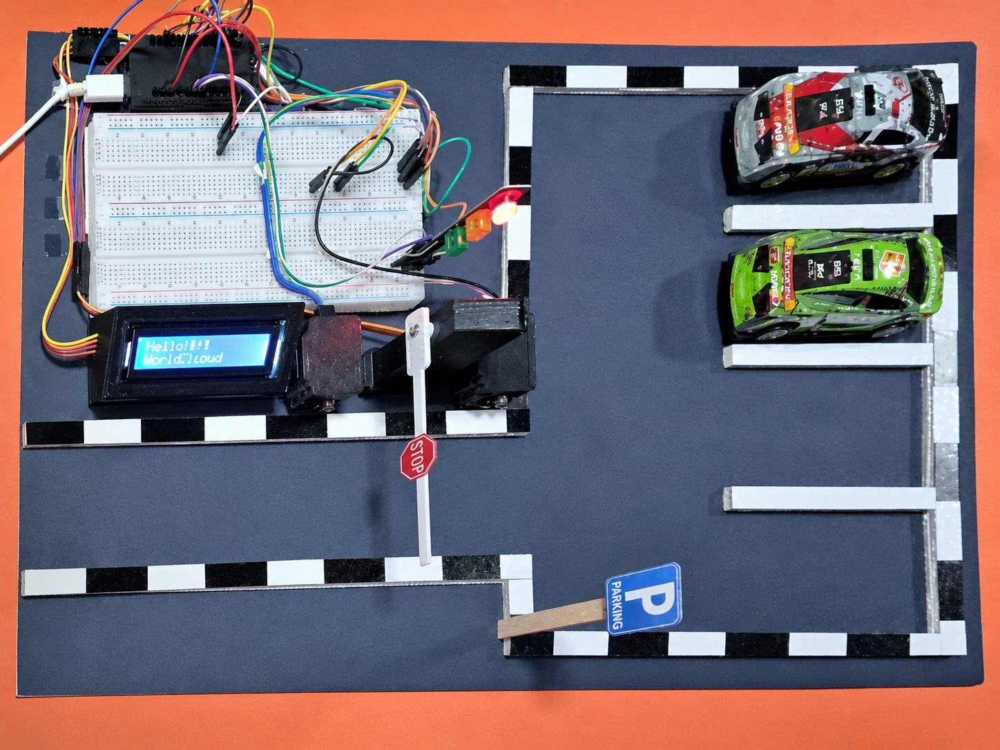
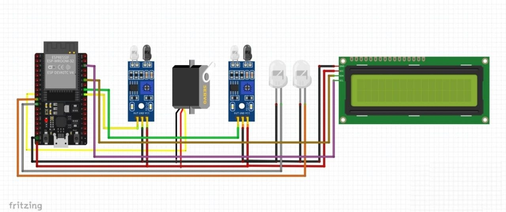
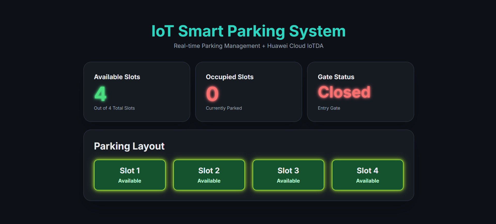

<div align="center">

# 🚗 IoT Smart Parking System

**Real-time parking management powered by ESP32 + Huawei Cloud IoTDA**

[](https://www.espressif.com/)
[](https://www.huaweicloud.com/)
[](https://mqtt.org/)

<!-- 📸 SCREENSHOT #1: Place your main dashboard screenshot here -->
<!-- Suggested: A full-width screenshot of the web dashboard showing slots, gate status, and parking layout -->
<!-- Resize to ~900px wide for best appearance on GitHub -->


</div>

---

## 📖 Overview

The **IoT Smart Parking System** is an embedded solution built on the **ESP32** microcontroller that automates parking slot management in real time. It uses **IR sensors** to detect entering and exiting vehicles, controls a **servo motor barrier gate**, updates a **16×2 LCD display** with live occupancy info, and streams all data to **Huawei Cloud IoTDA** via **secure MQTT (TLS/port 8883)**.

A built-in **web dashboard** (served directly from the ESP32) lets anyone on the same Wi-Fi network monitor slot availability and gate status from any browser — no app required.

---

## ✨ Features

| Feature | Details |
|---|---|
| 🔍 **Auto Vehicle Detection** | IR sensors at entry & exit trigger gate open/close automatically |
| 🚧 **Servo Barrier Gate** | Opens for 2 seconds on detection, then closes non-blocking |
| 📟 **LCD Live Display** | Shows available/total slots and gate state in real time |
| 🚦 **Traffic Light** | Green = slots available · Red = parking full |
| 🌐 **Local Web Dashboard** | Real-time UI served from ESP32 |
| ☁️ **Huawei Cloud IoTDA** | Publishes slot and gate data to cloud every 5 seconds via MQTTS |
| 🔒 **TLS Encrypted MQTT** | Secure connection on port 8883 |

---

## 🛠️ Hardware Components

| Component | Qty | Pin |
|---|---|---|
| ESP32 Dev Board | 1 | — |
| IR Obstacle Sensor (Entry) | 1 | GPIO 18 |
| IR Obstacle Sensor (Exit) | 1 | GPIO 19 |
| SG90 Servo Motor (Gate) | 1 | GPIO 25 |
| Green LED | 1 | GPIO 26 |
| Red LED | 1 | GPIO 27 |
| 16×2 I2C LCD (addr 0x27) | 1 | SDA/SCL |

<!-- 📸 SCREENSHOT #2: Place your circuit/wiring diagram or breadboard photo here -->
<!-- Suggested: A clean top-down photo of your wired breadboard or a Fritzing wiring diagram -->
<!-- Label it clearly, especially sensor and servo connections -->


---

## 🏗️ System Architecture

```
┌─────────────────────────────────────────────────────┐
│                    ESP32                            │
│                                                     │
│  IR Entry Sensor ──► Entry Logic ──► Servo Gate     │
│  IR Exit Sensor  ──► Exit Logic  ──► Servo Gate     │
│                         │                           │
│                    Slot Counter                     │
│                    /          \                     │
│              LCD Display    LED Indicators          │
│                    │                                │
│              Web Server (Port 80)                   │
│              MQTT Client (Port 8883)                │
└──────────────────────────┬──────────────────────────┘
                           │ Wi-Fi
              ┌────────────▼────────────┐
              │   Huawei Cloud IoTDA    │
              │  (Real-time Telemetry)  │
              └─────────────────────────┘
                           │
              ┌────────────▼────────────┐
              │   Local Web Dashboard   │
              │   (Any browser on LAN)  │
              └─────────────────────────┘
```

---

## 📂 Project Structure

```
iot-smart-parking-system/
│
├── smart_parking_system.ino
├── README.md
├── .gitignore
└── images/
    ├── project.png
    ├── circuit.jpg
    ├── web_dashboard.png
    └── hardware/
        ├── Traffic_light.jpg
        ├── IR_sensor.jpg
        ├── ESP32.jpg
        ├── Servo_180deg.jpg
        └── LCD_16x2_I2C.png
```

---

## 📦 Libraries Required

Install all libraries from **Arduino IDE → Library Manager** or **PlatformIO**:

```
WiFi.h             — Built-in ESP32
WiFiClientSecure.h — Built-in ESP32
WebServer.h        — Built-in ESP32
ESP32Servo         — by Kevin Harrington
PubSubClient       — by Nick O'Leary
ArduinoJson        — by Benoit Blanchon
LiquidCrystal_I2C  — by Frank de Brabander
```

---

## ⚙️ Configuration

Before uploading, open `smart_parking_system_final.ino` and update these values at the top of the file:

```cpp
// Wi-Fi
const char* ssid          = "YOUR_WIFI_SSID";
const char* wifi_password = "YOUR_WIFI_PASSWORD";

// Huawei IoTDA
#define MQTT_SERVER   "YOUR_IOTDA_ENDPOINT"
#define MQTT_USERNAME "YOUR_DEVICE_ID_SECRET"
#define MQTT_PASSWORD "YOUR_DEVICE_PASSWORD"
#define MQTT_CLIENTID "YOUR_CLIENT_ID"
#define DEVICE_ID     "YOUR_DEVICE_ID"
```

> ⚠️ **Security Note:** Never commit real credentials to a public repository. Use a `.env` file or Arduino secrets manager, and add it to `.gitignore`.

---

## 🚀 Getting Started

**1. Clone the repository**
```bash
git clone https://github.com/YOUR_USERNAME/iot-smart-parking-system.git
cd iot-smart-parking-system
```

**2. Install dependencies**

Open Arduino IDE, go to **Sketch → Include Library → Manage Libraries**, and install each library listed in the [Libraries Required](#-libraries-required) section.

**3. Configure credentials**

Edit the `#define` block at the top of the `.ino` file with your Wi-Fi and Huawei IoTDA credentials.

**4. Select board and port**

In Arduino IDE: **Tools → Board → ESP32 Dev Module**, then select your COM port.

**5. Upload**

Click **Upload (→)**. Open **Serial Monitor** at `115200 baud` to watch the boot sequence.

**6. Open the dashboard**

Once connected, the Serial Monitor prints the IP address:
```
Web server started at http://192.168.x.x
```
Open that address in any browser on the same Wi-Fi network.

<!-- 📸 SCREENSHOT #3: Place your Serial Monitor boot log screenshot here -->
<!-- Suggested: Screenshot of the Arduino Serial Monitor showing WiFi connected, MQTT connected, topics subscribed -->

---

## 🌐 Web Dashboard

The ESP32 hosts a responsive dashboard at its local IP address. It refreshes automatically every **2 seconds** and shows:

- ✅ Available and occupied slot count
- 🚧 Gate status (Open / Closed) with color indicator
- 🅿️ Visual parking layout with per-slot status

<!-- 📸 SCREENSHOT #4: Place a mobile screenshot of the dashboard here -->
<!-- Suggested: Screenshot of the dashboard on a phone browser showing the slot grid -->


---

## ☁️ Huawei Cloud IoTDA Integration

The ESP32 connects to **Huawei Cloud IoT Device Access (IoTDA)** over **MQTT with TLS (port 8883)**, sending live parking data directly to the cloud — no middleman, no polling.

---

### How It Works

Every **5 seconds**, and immediately after any gate event (car enters or exits), the ESP32 publishes a JSON payload to the cloud reporting the current parking state.

**Published topic:**
```
$oc/devices/{device_id}/sys/properties/report
```

**Payload format:**
```json
{
  "services": [
    {
      "service_id": "parking",
      "properties": {
        "available_slots": 3,
        "occupied_slots": 1,
        "gate_status": "Closed"
      }
    }
  ]
}
```

The three reported properties map directly to what the physical system tracks:

| Property | Description |
|---|---|
| `available_slots` | How many slots are still free |
| `occupied_slots` | How many cars are currently parked (`total - available`) |
| `gate_status` | `"Open"` while the barrier is raised, `"Closed"` otherwise |

---

### Connection Setup

The ESP32 handles the full MQTT lifecycle in firmware:

1. **Wi-Fi connects** first, then TLS is configured with `setInsecure()` (skips certificate pinning for simplicity).
2. **MQTT connects** using the IoTDA device credentials (Client ID, Username, Password) generated from the Huawei console.
3. On successful connection, the device **subscribes** to three downlink topics so it can receive cloud commands in the future:
   - `sys/commands/#` — for remote commands
   - `sys/properties/report/#` — for property acknowledgements
   - `user/#` — for custom user messages
4. If the connection drops at any point, `connectMQTT()` automatically **reconnects** before the next publish.

---


### Viewing the Data on Huawei IoTDA

Once the device is registered and running, incoming telemetry can be monitored from the **IoTDA console**:

1. Go to **IoTDA → Devices → [your device] → Message Trace** to see raw MQTT messages arriving.
2. Go to **Device Shadow** to see the latest reported property values persisted by the cloud.
3. The `parking` service and its three properties (`available_slots`, `occupied_slots`, `gate_status`) will appear under the device's **property report** section as defined in your product model.

> **Note:** A product model (also called a Thing Model) must be defined in the IoTDA console with a `parking` service containing the three properties above, so the platform can correctly interpret and store the incoming data.

---

## 🔮 Future Improvements

- [ ] License plate recognition with ESP32-CAM
- [ ] HTTPS dashboard with authentication
- [ ] Huawei Cloud dashboard with historical graphs
- [ ] OTA (Over-the-Air) firmware updates

